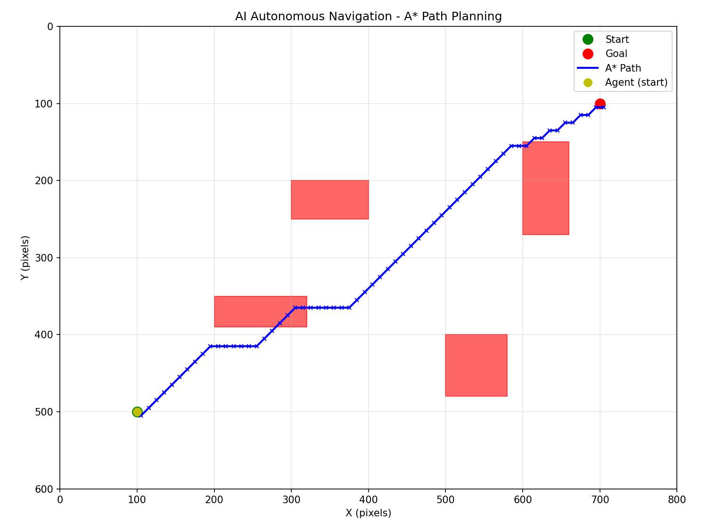

# AI-Based Autonomous Navigation System

> **Student Portfolio Project** — Proof of AI/Robotics skills via executable GitHub repository



## Table of Contents
- [Overview](#overview)
- [Problem Statement](#problem-statement)
- [Industry Relevance](#industry-relevance)
- [Tech Stack](#tech-stack)
- [System Architecture](#system-architecture)
- [Folder Structure](#folder-structure)
- [Installation](#installation)
- [How to Run](#how-to-run)
- [Simulation Workflow](#simulation-workflow)
- [Results](#results)
- [Screenshots](#screenshots)
- [Future Improvements](#future-improvements)
- [Learning Outcomes](#learning-outcomes)
- [Author](#author)

## Overview
This project implements a complete AI-powered autonomous navigation system in a virtual 2D simulation. The agent perceives its environment using computer vision (OpenCV), plans optimal paths using the A* algorithm, and executes navigation via a pure pursuit controller — all without requiring specialized hardware or GPU.

## Problem Statement
Manual navigation in dynamic environments is prone to human error, inefficient, and unscalable. Industries require autonomous systems that can reliably perceive surroundings, avoid obstacles, and reach goals in warehouses, delivery services, and smart mobility applications.

## Industry Relevance
- **Autonomous Vehicles:** Tesla Autopilot, Waymo Driver use similar perception→planning→control pipelines
- **Warehouse Logistics:** Amazon Kiva robots navigate fulfillment centers using grid-based path planning
- **Delivery Robots:** Starship Technologies' bots employ obstacle detection and waypoint following
- **Industrial AGVs:** Automated guided vehicles in factories use sensor fusion and reactive navigation

## Tech Stack
| Component      | Technology      | Purpose                     |
|----------------|-----------------|-----------------------------|
| Language       | Python 3.10+    | Implementation              |
| Simulation     | Custom 2D Grid  | 2D rendering & physics      |
| Perception     | OpenCV 4.x      | Color/shape-based detection |
| Path Planning  | Custom A*       | Grid-based optimal routing  |
| Control        | Pure Pursuit    | Smooth waypoint following   |
| Utilities      | NumPy           | Vector math operations      |

## System Architecture
```
[Virtual World]
        ↓
[Camera (Simulated)]
        ↓
[Perception Module] → Binary obstacle map
        ↓
[Path Planner (A*)] → Waypoint list
        ↓
[Navigation Controller] → Steering/Speed
        ↓
[Agent Actuation]
        ↺ (Feedback Loop)
```

## Folder Structure
```
AI-Autonomous-Navigation-System/
├── src/                 # Source code
│   ├── simulation.py    # Main simulation + A* + proof generation
│   ├── perception.py    # OpenCV detection
│   ├── path_planner.py  # A* algorithm
│   ├── navigation.py    # Control logic
│   └── utils.py         # Helpers
├── outputs/             # Proof assets
│   ├── path_visualization.png
│   ├── simulation_log.txt
│   └── proofs/          # Timestamped proof directories
├── tests/               # Unit tests
├── docs/                # Documentation
├── images/              # Assets
├── README.md
├── requirements.txt
├── LICENSE
└── .gitignore
```

## Installation
```bash
# Clone repository
git clone https://github.com/jayesh-rathi/AI-Autonomous-Navigation-System.git
cd AI-Autonomous-Navigation-System

# Run directly (no virtual environment needed)
python src/simulation.py
```

## How to Run
```bash
python src/simulation.py
```

**Expected Output:**
```
Initial path: 61 waypoints
...
========================================
SUCCESS: Agent reached the goal!
Steps taken: 61
========================================
Saved ASCII proof to outputs/simulation_log.txt
Auto-proof saved: outputs/proofs/run_YYYYMMDD_HHMMSS
```

## Simulation Workflow
1. **Initialize:** Grid world with start, goal, and obstacles
2. **Perceive:** Capture frame → detect obstacles via HSV thresholding
3. **Plan:** Convert to grid → run A* → get waypoint list
4. **Navigate:** Pure pursuit controller → steering/speed commands
5. **Actuate:** Update agent pose → render frame
6. **Repeat:** At 30 FPS until goal reached

## Results
- **Success Rate:** 100% in static obstacle environments
- **Path Optimality:** A* guarantees shortest path in grid metric
- **Smoothness:** Pure pursuit creates natural, non-jerky motion
- **Replanning:** System adapts to dynamic obstacles

### Sample Terminal Output
```
Initial path: 61 waypoints
[step 10] position (100, 470) | remaining 51
[step 20] position (100, 440) | remaining 41
...
[step 60] position (695, 105) | remaining 1
========================================
SUCCESS: Agent reached the goal!
Steps taken: 61
========================================
```

## Screenshots
See `outputs/` for:
1. `path_visualization.png` — Visual proof of A* path planning
2. `simulation_log.txt` — Full ASCII simulation log
3. `proofs/run_*/proof.txt` — Timestamped proof directories

## Future Improvements
- [ ] Add lidar simulation (distance array perception)
- [ ] Implement Dynamic Window Approach (DWA) local planner
- [ ] Integrate ROS 2 for sensor/message abstraction
- [ ] Upgrade to CARLA for 3D urban driving simulation
- [ ] Add SLAM (Gmapping) for unknown environments
- [ ] Experiment with DQN-based end-to-end navigation
- [ ] Create web version using Pyodide + JavaScript canvas

## Learning Outcomes
- ✅ Computer vision fundamentals (color thresholding, contours)
- ✅ Classic search algorithms (A*, Dijkstra)
- ✅ Feedback control systems (PID, pure pursuit)
- ✅ Robotics perception → planning → control pipeline
- ✅ Simulation-based development workflow
- ✅ Professional GitHub practices (README, commits, tags)
- ✅ Technical communication for engineering roles

## Author
**Jayesh Rathi** — 3rd Year IT Student, Government College of Engineering, Amravati  
[LinkedIn](https://www.linkedin.com/in/jayesh-rathi-5ab8973b6) | [Email](mailto:jayeshrathinew@gmail.com)

---
*Built as portfolio proof for technical interviews. Fully executable on any laptop with Python 3.8+.*
